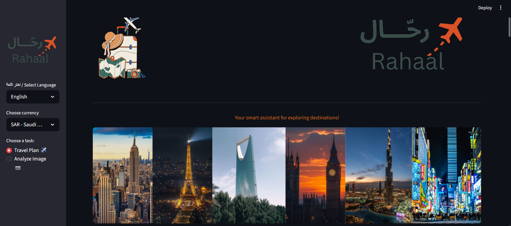
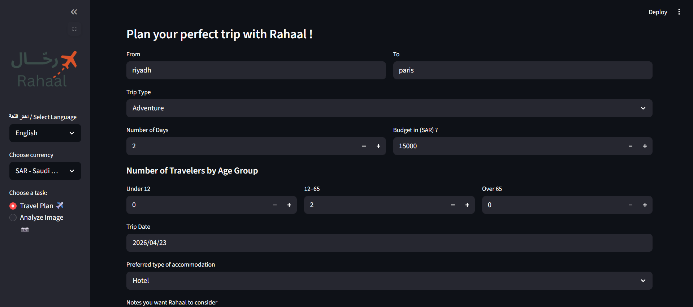
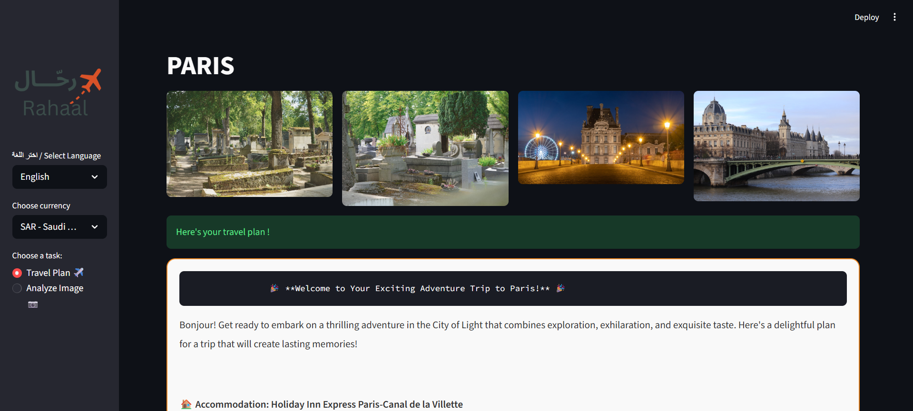
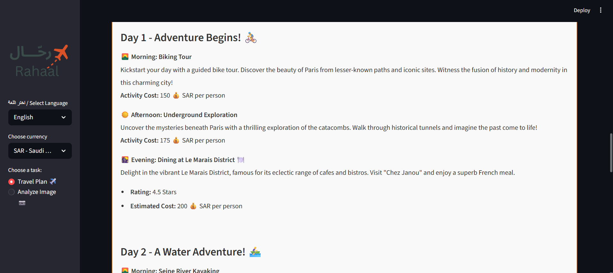
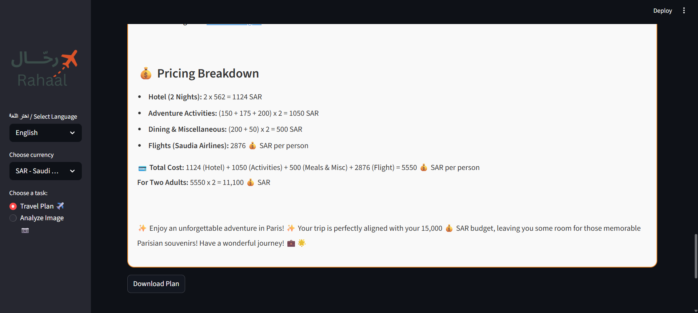

# Rahhal – AI Travel Planning Project

**Rahhal** is a web application built using AI technologies to help users plan customized travel itineraries. The system collects information from users (destination, duration, budget, number of people, type of trip) and generates a complete daily plan with detailed recommendations and images. Users can also upload a photo of a tourist landmark to get intelligent information about it.

---

## Problem
Many travelers, especially non-experts, face challenges such as:

- Difficulty choosing a suitable destination.  
- Difficulty creating a detailed daily schedule based on time and budget.  
- Time-consuming search for attractions suitable for different age groups.  
- Lack of tools supporting the Arabic language.  
- Wasting time planning trips.  
- Choosing inappropriate destinations or activities.  
- Wasting budget or poor budget allocation.  
- Reliance on scattered websites such as Booking, TripAdvisor, and Google.  

---

## Added Value
Rahhal provides the following benefits:

- Image analysis and landmark recognition, with suggestions for similar places.  
- Personalized destination suggestions based on user profile and preferences.  
- Saving time and effort in trip planning.  
- Creating smart or mood-based detailed itineraries.  

---
## Features
- AI-powered itinerary generation.  
- User-defined preferences (budget, duration, trip type, number of people).  
- Image-based landmark recognition.  
- Smart daily travel plans with photos and detailed recommendations.  
- Arabic and English support.  
- Interactive front-end interface.

 ---
 
## Development Plan
Future enhancements include:

- Enabling direct booking from the platform.  
- Providing detailed information about suggested places based on user analysis.  
- Allowing users to ask questions about uploaded landmark images.  

---
## Screenshots

## Technologies Used

- Python
- HTML
- CSS
- Streamlit
- Unsplash API
- Google Vision API
- CrewAI
- GPT-4

---

## Project Goal
To simplify travel planning by providing an AI-powered system that generates complete, personalized itineraries, saves time, and enhances the overall travel experience.  

